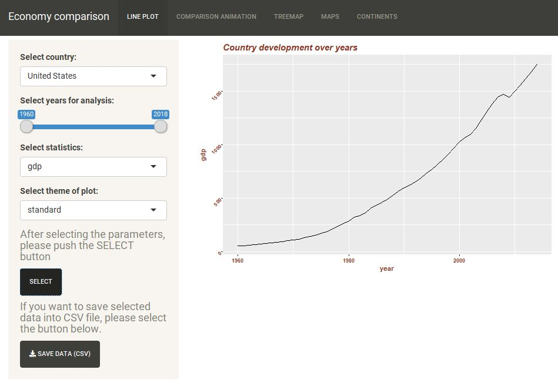
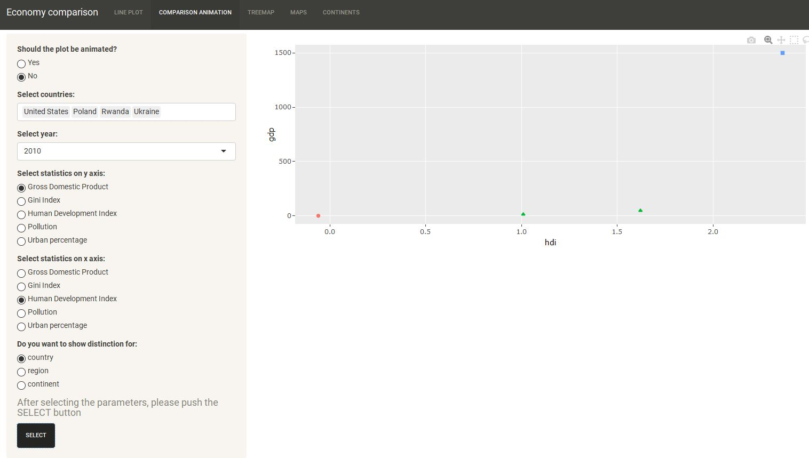
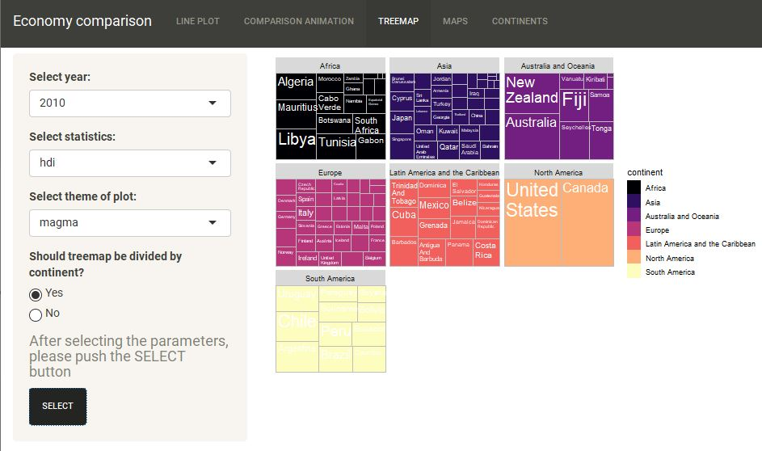
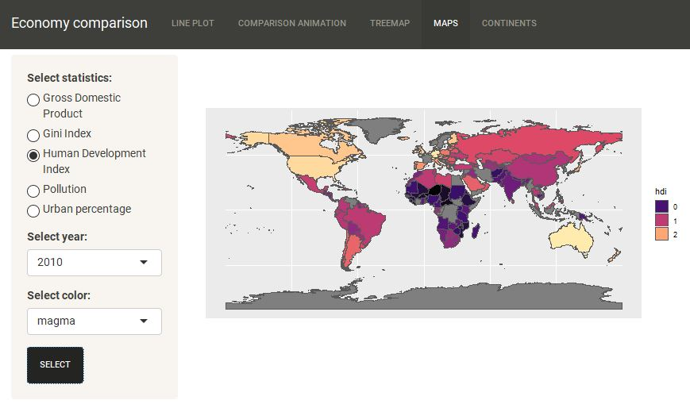
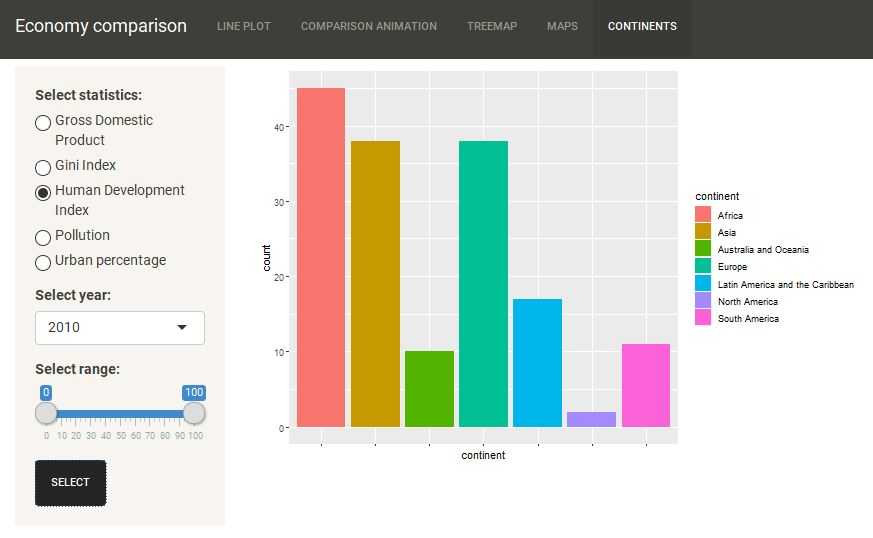

```{r setup, include=FALSE}
knitr::opts_chunk$set(echo = TRUE)
knitr::opts_chunk$set(fig.width=12, fig.height=8) 

library(ggplot2)
library(dplyr)
library(colourpicker) 
library(RColorBrewer)
library(data.table)
library(DT)
library(tibble)
library(plotly)
library(gganimate)
library(ggthemes)
library(treemapify)
library(treemap)
library(rnaturalearth)
library(sf)
library(countrycode)
library(rgeos)
library(readr)
library(grid)
library(gridExtra)


setwd("C:\\Users\\jakub\\Downloads\\RVisualisation-master (1)\\RVisualisation-master")

data<-read_csv("my_data_new.csv")
world <- ne_countries(scale = "medium", returnclass = "sf")
DATA <-fread("my_data_new.csv")
cc <- countrycode::codelist

countries <- unique(DATA$country)
mapping <- data.table(countries,iso = countrycode::codelist$iso3c[match(countries,countrycode::codelist$country.name.en)])

country = c("Czech Republic", "Russian Federation", "Korea, Rep.", "Egypt, Arab Rep.", "Congo, Rep.","Venezule" )
iso = c("CZE", "RUS", "KOR", "EGY", "COG", "VEN")

manual_mapping <- data.table(countries = country, iso)
mapping <- rbind(mapping[!is.na(iso),], manual_mapping)
mapping[,country:= countries]
mapping[,countries:=NULL]
DATA <- merge(DATA,mapping, by= "country" , all.x = T)
rm(mapping, country, iso, countries)
```

## Introduction

As our final project for the subject Advanced Visualisation in R we have decided to develop a Shiny application that enables an analysis of multiple economical factors across the world. The analysis can be conduct for separate countries, regions or continents. 

Human development is a process of both enlarging people‘s choices and increasing their freedom of choices. It can be achieved by expanding human capabilities and contestability [5]. Increasing income level is one of the main means of expanding choices and well-being. Before we start our analysis, we had to decide what form of human development to analyze. It is not enough to measure society’s development using GDP. On the other hand, there is not enough data regarding factors such as nutrition or education it is not easy to measure and compare them. That are the reasons why we have chosen to use Human Development Index. It is the most popular measure of development nowadays. 

HDI is more about measuring the richness of human life, rather than simply the richness of the economy in which human beings live (this can be measured as country’s GDP). The HDI can also be used to question national policy choices. The HDI is the geometric mean of normalized indices for each of the three key dimensions of human development:

• long and healthy life - assessed by life expectancy at birth,

• being knowledgeable - assessed by mean of years of schooling for adults aged >25 years and expected years of schooling for children of school entering age,

• have a decent standard of living - measured by gross national income per capita. The HDI uses the logarithm of income, to reflect the diminishing importance of income with increasing GNI.

The HDI simplifies and captures only part of what human development entails. This is one of the reasons why HDI is being criticized by some researchers. Index does not reflect on inequalities, poverty, human security, empowerment, etc. That results in a debate about the impact of inequality on economic growth. Such a debate has been in the center of a wide range of economic research, governments and politicians for decades.

In such a debate, important question was “what is the relationship between different economical factors like inequality, urban development or air pollution and human development”. People are trying to examine how much of an impact does these factors have on overall human quality in different parts of the world. There are countries that are thought to have significantly high standards of living. United States of America is an example of such a country. USA is believed to have a relatively small level of inequality when comparing to developing nations across the globe. Almost all of the US citizens have the luxury to purchase a wide array of consumer goods and accessibility to education and health insurance.

On the other side, there were some governments in the past such as in the Soviet Union, that had a complete control over economies and politics. They were officially announcing the equality of all the people, but usually it resulted in huge difference in life quality between middle or lower classes and people who have power. 

We can also highlight countries with such a huge inequalities nowadays as well. In multiple African countries, like Rwanda, huge income inequality exists. These countries suffer from low standards of human development and severe poverty. We are sure, that people in that countries are unequal in more ways than just income, such as culture and genetic talent, but it is difficult to quantify the extent to which those factors affect income production, life expectancy, and education levels. This leaves us with just income inequality as the easiest quantifiable factor that can be included in the basic analysis.

Our application enables to answer the question if the income inequality is a factor in producing low human development? We have used Gini index as a proxy for income inequality. Gini index (also known as Gini coefficient) is a measure of statistical dispersion that represents the income or wealth distribution of a nation’s residents, and is the most commonly used measurement of inequality. The Gini index measures the inequality among values of a frequency distribution (in our case, levels of income). Value of zero expresses perfect equality, where all values are the same (e.g. everyone has the same income). A Gini index of 1 (100%) expresses maximal inequality among values (e.g., for a large number of people, where only one person has all the income or consumption, and all others have none, the Gini coefficient will be very nearly one). In our dataset the values were between 0 and 100, we have unified them to range (-2:2).

What is more, our application enables to use urban population as an additional variable to compare. It is relevant to urban economic theory, especially to on the urban wage premium and Central Place Theory (CTM). It is proved that large urban population sizes lead to positive effects on employment, consumption, overall GDP. Finally, this leads to higher Human Development Index levels.

The variable that indicates average air pollution in each country is available too. It is easy to conclude, that high levels of pollution can lead to higher deaths and a lower standard of living. The last variable we decided to use may have been the most reliable in determining its effects on income and human development indices.

Our analysis will be divided into two parts. In the first one, we would like to compare the factors mentioned across few countries like United States of America, Ukraine (as the former USSR country), Rwanda. We would compare these countries to Poland. In the next step, we would like to go to the higher level and compare the whole continents, especially we would focus on continents that the countries mentioned are parts of, it is North America, Africa and Europe.


## Exploratory Data Analysis


Let's begin with short exploratory data analysis. Reader can find short description of data used in the following project below:

```{r}
head(data)

summary(data)
```


## Economy changes over years


Before we start deeper analysis, let's have a look at the layout of the application. In first tab, user has ability to check how each statistics (gdp, gini index, urban population, air pollution and HDI index) presented for each country over the years.

```{r, echo=FALSE, fig.cap="Line Chart Tab", out.width = '100%'}

```

In first step, we would have a look on line charts presenting how the GDP was changing in the selected countries. For better view, the axes have different ranges as there are big differences especially between USA and other countries. There is also no data for years 1960-1990 for Ukraine and Poland.

```{r, include=FALSE}
wybraneDane1 <- data %>% 
        filter(country == "United States") %>% 
        filter(year >= "1960") %>% 
        filter(year <= "2018")

wykres1 <- ggplot(data = wybraneDane1) 
wykres1 <- wykres1 +
        geom_line(aes(x = year,
                      y = gdp,
                      color = "line")) +
        labs(x = "year",
             y = "gdp",
             title = "United States development over years")

wykres1 <- wykres1 + theme_economist() + scale_colour_economist() + theme(legend.position = "none")

wybraneDane2 <- data %>% 
        filter(country == "Ukraine") %>% 
        filter(year >= "1985") %>% 
        filter(year <= "2018")

wykres2 <- ggplot(data = wybraneDane2) 
wykres2 <- wykres2 +
        geom_line(aes(x = year,
                      y = gdp,
                      color = "line")) +
        labs(x = "year",
             y = "gdp",
             title = "Ukraine development over years")

wykres2 <- wykres2 + theme_economist() + scale_colour_economist() + theme(legend.position = "none")


wybraneDane3 <- data %>% 
        filter(country == "Rwanda") %>% 
        filter(year >= "1960") %>% 
        filter(year <= "2018")

wykres3 <- ggplot(data = wybraneDane3) 
wykres3 <- wykres3 +
        geom_line(aes(x = year,
                      y = gdp,
                      color = "line")) +
        labs(x = "year",
             y = "gdp",
             title = "Rwanda development over years")

wykres3 <- wykres3 + theme_economist() + scale_colour_economist() + theme(legend.position = "none")


wybraneDane4 <- data %>% 
        filter(country == "Poland") %>% 
        filter(year >= "1990") %>% 
        filter(year <= "2018")

wykres4 <- ggplot(data = wybraneDane4) 
wykres4 <- wykres4 +
        geom_line(aes(x = year,
                      y = gdp,
                      color = "line")) +
        labs(x = "year",
             y = "gdp",
             title = "Poland development over years")

wykres4 <- wykres4 + theme_economist() + scale_colour_economist() + theme(legend.position = "none")
```


```{r message=FALSE, warning=FALSE }
grid.arrange(wykres1, wykres2, wykres3, wykres4, ncol = 2)
```

From the following plots, we can notice that in all selected countries, GDP has rised. In all the countries there were better and worse periods of time, it can be seen especially in Rwanda in years 1995-2001 and Ukraine in years 1990-2000 and 2008-2010. 


```{r, include=FALSE}
wybraneDane1 <- data %>% 
        filter(country == "United States") %>% 
        filter(year >= "1990") %>% 
        filter(year <= "2018")

wykres1 <- ggplot(data = wybraneDane1) 
wykres1 <- wykres1 +
        geom_point(aes(x = year,
                      y = hdi,
                      color = "line")) +
        labs(x = "year",
             y = "hdi",
             title = "United States development over years")

wykres1 <- wykres1 + theme_solarized() + scale_colour_solarized() + theme(legend.position = "none")

wybraneDane2 <- data %>% 
        filter(country == "Ukraine") %>% 
        filter(year >= "1990") %>% 
        filter(year <= "2018")

wykres2 <- ggplot(data = wybraneDane2) 
wykres2 <- wykres2 +
        geom_point(aes(x = year,
                      y = hdi,
                      color = "line")) +
        labs(x = "year",
             y = "hdi",
             title = "Ukraine development over years")

wykres2 <- wykres2 + theme_solarized() + scale_colour_solarized() + theme(legend.position = "none")


wybraneDane3 <- data %>% 
        filter(country == "Rwanda") %>% 
        filter(year >= "1990") %>% 
        filter(year <= "2018")

wykres3 <- ggplot(data = wybraneDane3) 
wykres3 <- wykres3 +
        geom_point(aes(x = year,
                      y = hdi,
                      color = "line")) +
        labs(x = "year",
             y = "hdi",
             title = "Rwanda development over years")

wykres3 <- wykres3 + theme_solarized() + scale_colour_solarized() + theme(legend.position = "none")


wybraneDane4 <- data %>% 
        filter(country == "Poland") %>% 
        filter(year >= "1990") %>% 
        filter(year <= "2018")

wykres4 <- ggplot(data = wybraneDane4) 
wykres4 <- wykres4 +
        geom_point(aes(x = year,
                      y = hdi,
                      color = "line")) +
        labs(x = "year",
             y = "hdi",
             title = "Poland development over years")

wykres4 <- wykres4 + theme_solarized() + scale_colour_solarized() + theme(legend.position = "none")
```

\pagebreak

```{r message=FALSE, warning=FALSE }
grid.arrange(wykres1, wykres2, wykres3, wykres4, ncol = 2)
```


Similarily to the chart of GDP, usually Human Development Index was rising. However there were some periods of time, when the HDI decreased. For Rwanda and Ukraine this period is coincident in GDP decrease.

```{r, include=FALSE}
wybraneDane1 <- data %>% 
        filter(country == "United States") %>% 
        filter(year >= "2000") %>% 
        filter(year <= "2018")

wykres1 <- ggplot(data = wybraneDane1) 
wykres1 <- wykres1 +
        geom_point(aes(x = year,
                      y = gini,
                      color = "line")) +
        labs(x = "year",
             y = "gini",
             title = "United States development over years")

wykres1 <- wykres1 + scale_color_manual(values = "black") + 
          theme(plot.title = element_text(color = 'tomato4', size = 15, face = 'bold.italic'),
                                         legend.position = "none",
                                         axis.title = element_text(face = "bold", color = "tomato4"),
                                         axis.text.x = element_text(face = "bold", color = "tomato4"), # Options for labels of the x axis
                                         axis.text.y = element_text(face = "bold", color = "tomato4", angle = 45))

wybraneDane2 <- data %>% 
        filter(country == "Ukraine") %>% 
        filter(year >= "2000") %>% 
        filter(year <= "2018")

wykres2 <- ggplot(data = wybraneDane2) 
wykres2 <- wykres2 +
        geom_line(aes(x = year,
                      y = gini,
                      color = "line")) +
        labs(x = "year",
             y = "gini",
             title = "Ukraine development over years")

wykres2 <- wykres2 + scale_color_manual(values = "black") + 
          theme(plot.title = element_text(color = 'tomato4', size = 15, face = 'bold.italic'),
                                         legend.position = "none",
                                         axis.title = element_text(face = "bold", color = "tomato4"),
                                         axis.text.x = element_text(face = "bold", color = "tomato4"), # Options for labels of the x axis
                                         axis.text.y = element_text(face = "bold", color = "tomato4", angle = 45))


wybraneDane3 <- data %>% 
        filter(country == "Rwanda") %>% 
        filter(year >= "2000") %>% 
        filter(year <= "2018")

wykres3 <- ggplot(data = wybraneDane3) 
wykres3 <- wykres3 +
        geom_point(aes(x = year,
                      y = gini,
                      color = "line")) +
        labs(x = "year",
             y = "gini",
             title = "Rwanda development over years")

wykres3 <- wykres3 + scale_color_manual(values = "black") + 
          theme(plot.title = element_text(color = 'tomato4', size = 15, face = 'bold.italic'),
                                         legend.position = "none",
                                         axis.title = element_text(face = "bold", color = "tomato4"),
                                         axis.text.x = element_text(face = "bold", color = "tomato4"), # Options for labels of the x axis
                                         axis.text.y = element_text(face = "bold", color = "tomato4", angle = 45))

wybraneDane4 <- data %>% 
        filter(country == "Poland") %>% 
        filter(year >= "2000") %>% 
        filter(year <= "2018")

wykres4 <- ggplot(data = wybraneDane4) 
wykres4 <- wykres4 +
        geom_line(aes(x = year,
                      y = gini,
                      color = "line")) +
        labs(x = "year",
             y = "gini",
             title = "Poland development over years")

wykres4 <- wykres4 + scale_color_manual(values = "black") + 
          theme(plot.title = element_text(color = 'tomato4', size = 15, face = 'bold.italic'),
                                         legend.position = "none",
                                         axis.title = element_text(face = "bold", color = "tomato4"),
                                         axis.text.x = element_text(face = "bold", color = "tomato4"), # Options for labels of the x axis
                                         axis.text.y = element_text(face = "bold", color = "tomato4", angle = 45))
```

\pagebreak

```{r message=FALSE, warning=FALSE }
grid.arrange(wykres1, wykres2, wykres3, wykres4, ncol = 2)
```

Comparison of GINI Index is unfortunately a bit difficult as this is not a very popular index. That is the reason why charts for USA and Rwanda are point charts and not line plots as the others. It is impossible to draw a line plot if there is so much missing data what is the case of these countries. However, we can notice that in the last decade in all countries except USA, GINI Index has decreased. It means taht society is becoming more equal. That can also explain the increase of Human Development Index. 


```{r, include=FALSE}
wybraneDane1 <- data %>% 
        filter(country == "United States") %>% 
        filter(year >= "1960") %>% 
        filter(year <= "2018")

wykres1 <- ggplot(data = wybraneDane1) 
wykres1 <- wykres1 +
        geom_line(aes(x = year,
                      y = urban,
                      color = "line")) +
        labs(x = "year",
             y = "urban",
             title = "United States development over years")

wykres1 <- wykres1 + scale_color_manual(values = "white")+
          theme(line = element_line(color = "white", size = 0.5, linetype = 1, lineend = "butt"),
                                 plot.background=element_rect(fill = "gray"),
                                 panel.background = element_rect(fill = 'black'),
                                 plot.title = element_text(color = 'tomato4', size = 15, face = 'bold.italic'),
                                 panel.grid.major = element_blank(),
                                 panel.grid.minor = element_blank(),
                                 legend.position = "none",  
                                 axis.title = element_text(face = "bold", color = "tomato4"),
                                 axis.text.x = element_text(face = "bold", color = "tomato4"), # Options for labels of the x axis
                                 axis.text.y = element_text(face = "bold", color = "tomato4", angle = 45))

wybraneDane2 <- data %>% 
        filter(country == "Ukraine") %>% 
        filter(year >= "1960") %>% 
        filter(year <= "2018")

wykres2 <- ggplot(data = wybraneDane2) 
wykres2 <- wykres2 +
        geom_line(aes(x = year,
                      y = urban,
                      color = "line")) +
        labs(x = "year",
             y = "urban",
             title = "Ukraine development over years")

wykres2 <- wykres2 + scale_color_manual(values = "white")+
          theme(line = element_line(color = "white", size = 0.5, linetype = 1, lineend = "butt"),
                                 plot.background=element_rect(fill = "gray"),
                                 panel.background = element_rect(fill = 'black'),
                                 plot.title = element_text(color = 'tomato4', size = 15, face = 'bold.italic'),
                                 panel.grid.major = element_blank(),
                                 panel.grid.minor = element_blank(),
                                 legend.position = "none",  
                                 axis.title = element_text(face = "bold", color = "tomato4"),
                                 axis.text.x = element_text(face = "bold", color = "tomato4"), # Options for labels of the x axis
                                 axis.text.y = element_text(face = "bold", color = "tomato4", angle = 45))


wybraneDane3 <- data %>% 
        filter(country == "Rwanda") %>% 
        filter(year >= "1960") %>% 
        filter(year <= "2018")

wykres3 <- ggplot(data = wybraneDane3) 
wykres3 <- wykres3 +
        geom_line(aes(x = year,
                      y = urban,
                      color = "line")) +
        labs(x = "year",
             y = "urban",
             title = "Rwanda development over years")

wykres3 <- wykres3 + scale_color_manual(values = "white")+
          theme(line = element_line(color = "white", size = 0.5, linetype = 1, lineend = "butt"),
                                 plot.background=element_rect(fill = "gray"),
                                 panel.background = element_rect(fill = 'black'),
                                 plot.title = element_text(color = 'tomato4', size = 15, face = 'bold.italic'),
                                 panel.grid.major = element_blank(),
                                 panel.grid.minor = element_blank(),
                                 legend.position = "none",  
                                 axis.title = element_text(face = "bold", color = "tomato4"),
                                 axis.text.x = element_text(face = "bold", color = "tomato4"), # Options for labels of the x axis
                                 axis.text.y = element_text(face = "bold", color = "tomato4", angle = 45))

wybraneDane4 <- data %>% 
        filter(country == "Poland") %>% 
        filter(year >= "1960") %>% 
        filter(year <= "2018")

wykres4 <- ggplot(data = wybraneDane4) 
wykres4 <- wykres4 +
        geom_line(aes(x = year,
                      y = urban,
                      color = "line")) +
        labs(x = "year",
             y = "urban",
             title = "Poland development over years")

wykres4 <- wykres4 + scale_color_manual(values = "white")+
          theme(line = element_line(color = "white", size = 0.5, linetype = 1, lineend = "butt"),
                                 plot.background=element_rect(fill = "gray"),
                                 panel.background = element_rect(fill = 'black'),
                                 plot.title = element_text(color = 'tomato4', size = 15, face = 'bold.italic'),
                                 panel.grid.major = element_blank(),
                                 panel.grid.minor = element_blank(),
                                 legend.position = "none",  
                                 axis.title = element_text(face = "bold", color = "tomato4"),
                                 axis.text.x = element_text(face = "bold", color = "tomato4"), # Options for labels of the x axis
                                 axis.text.y = element_text(face = "bold", color = "tomato4", angle = 45))
```

\pagebreak

```{r message=FALSE, warning=FALSE }
grid.arrange(wykres1, wykres2, wykres3, wykres4, ncol = 2)
```


In case of urban population ratio, so the percantage of whole country population that lives in the urban areas, there can't be seen any association with HDI. In all countries the ratio is increasing. Maybe except Poland in XXI century, but it is quite common in our country, that people are moving from cities to the rural ares just outside the city.  

\pagebreak

## Direct Comparison of Countries

Next tab of our application is much better for comparison of multiple countries at once. It can be presented as an animation as well as single chart that enables comparison for a given year. Below, reader can find the screenshot from the second tab:  

```{r, echo=FALSE, fig.cap="Line Chart Tab", out.width = '100%'}

```

It is, of course, impossible, to show animation in a paper report, however comparison for the countries in different years will be presented.

```{r, include=FALSE}
dane_wybrane1 <- data %>% 
        filter(country %in% c("United States", "Rwanda", "Ukraine", "Poland")) %>% 
        filter(year == 2000)

dane_wybrane2 <- data %>% 
        filter(country %in% c("United States", "Rwanda", "Ukraine", "Poland")) %>% 
        filter(year == 2010)

wykres_scatter_no_anim1 <- ggplot(data = dane_wybrane1, aes(x = hdi,y=gdp,label=country,col=continent,shape=region))

wykres_scatter_no_anim1 <- wykres_scatter_no_anim1 +
        geom_point() + 
        xlab("hdi") + 
        ylab("gdp") +
        scale_x_continuous(limits = c(-1, 3)) +
        scale_y_continuous(limits = c(-100, 1600)) +
  ggtitle("Comparison for year 2000")

wykres_scatter_no_anim2 <- ggplot(data = dane_wybrane2, aes(x = hdi,y=gdp,label=country,col=continent,shape=region))

wykres_scatter_no_anim2 <- wykres_scatter_no_anim2 +
        geom_point() + 
        xlab("hdi") + 
        ylab("gdp") +
        scale_x_continuous(limits = c(-1, 3)) +
        scale_y_continuous(limits = c(-100, 1600)) +
        ggtitle("Comparison for year 2010")

```

\pagebreak

```{r message=FALSE, warning=FALSE }
grid.arrange(wykres_scatter_no_anim1, wykres_scatter_no_anim2, ncol = 2)
```  

From the charts presented above, in case of HDI we can notice some interesting trends. In the decade we focused on, so years 2000-2010 Human Development Index for all the countries have increased, however it was not proportional. Distance between Rwanda and Ukraine has shrinken, while distance between Poland and Ukraine has increased. The conclusion is simple, Ukraine is the biggest loser within the four countries under examination. 

What is more, in case of GDP, also Ukranian results are not satisfactory for its inhabitants. The biggest 'leap' was done by United States of America. Even though, the financial crisis took place in 2008, their GDP has increased by about 50%. We can also notice quite a big change of Poland's GDP, what is a very good news. It can be also seen that the higher GDP, the higher HDI.
     
```{r, include=FALSE}
wykres_scatter_no_anim1 <- ggplot(data = dane_wybrane1, aes(x = hdi,y=gini,label=country,col=continent,shape=region))

wykres_scatter_no_anim1 <- wykres_scatter_no_anim1 +
        geom_point() + 
        xlab("hdi") + 
        ylab("gini") +
        scale_x_continuous(limits = c(-1, 3)) +
        scale_y_continuous(limits = c(-1.2, 0)) +
  ggtitle("Comparison for year 2000")

wykres_scatter_no_anim2 <- ggplot(data = dane_wybrane2, aes(x = hdi,y=gini,label=country,col=continent,shape=region))

wykres_scatter_no_anim2 <- wykres_scatter_no_anim2 +
        geom_point() + 
        xlab("hdi") + 
        ylab("gini") +
        scale_x_continuous(limits = c(-1, 3)) +
        scale_y_continuous(limits = c(-1.2, 0)) +
        ggtitle("Comparison for year 2010")

```


\pagebreak


```{r message=FALSE, warning=FALSE }
grid.arrange(wykres_scatter_no_anim1, wykres_scatter_no_anim2, ncol = 2)
```       
     

Next plot presents the relationship between HDI and GINI Index. There is no exact information for Ukraine for year 2000, but we can notice that the value is quite good (as a reminder: values in our dataset have range [-2;2], when the lowest value is, the more equal country is). It can be noticed that countries with communistic history are generally more equal in case of wealth distribution of a nation’s residents. It quite surprising if we compare it with general knowledge and opinions that were mentioned in the introduction of this report. In the decade under examination both Rwanda and Poland has become more equal, what is good and a bit inconsistent with all the information from media that world is becoming more and more inequal. However, Rwanda is still much worse in case of equalityy than the competitors. The gap has not changed in USA, the inequality has even slightly increased. From that plot, no relationship can be noticed between Gini coefficient and Human Development Index.


```{r, include=FALSE}
wykres_scatter_no_anim1 <- ggplot(data = dane_wybrane1, aes(x = hdi,y=urban,label=country,col=continent,shape=region))

wykres_scatter_no_anim1 <- wykres_scatter_no_anim1 +
        geom_point() + 
        xlab("hdi") + 
        ylab("urban") +
        scale_x_continuous(limits = c(-1, 3)) +
        scale_y_continuous(limits = c(-2, 2)) +
  ggtitle("Comparison for year 2000")

wykres_scatter_no_anim2 <- ggplot(data = dane_wybrane2, aes(x = hdi,y=urban,label=country,col=continent,shape=region))

wykres_scatter_no_anim2 <- wykres_scatter_no_anim2 +
        geom_point() + 
        xlab("hdi") + 
        ylab("urban") +
        scale_x_continuous(limits = c(-1, 3)) +
        scale_y_continuous(limits = c(-2, 2)) +
        ggtitle("Comparison for year 2010")

```


\pagebreak


```{r message=FALSE, warning=FALSE }
grid.arrange(wykres_scatter_no_anim1, wykres_scatter_no_anim2, ncol = 2)
``` 


Interesting fact can be noticed from the last plot. In all countries, except Rwanda, between 2000 and 2010 more people moved out from the cities. There is a huge difference in urbanization ratio between USA, European countries and Rwanda. Generally speaking, the highest urbanization, the highest HDI - this rule can be noticed from the analysis.

## Treemap - general overview

User can compare also all countries on treemap. This kind of plot provides quick overview on all countries in the world and similarities or differences between them. Here, it is impossible to compare only four chosen countries, but also some interesting conclusions can be drown, based on data from more countries. 


```{r, echo=FALSE, fig.cap="Line Chart Tab", out.width = '100%'}

```

```{r, include=FALSE}
dane_wybrane_tm <- data %>% 
        filter(year == 2010) %>%
        filter(continent != "Eastern Europe")

```

```{r, include = FALSE, message=FALSE, warning=FALSE }
wykres_tree_map <- ggplot(data = dane_wybrane_tm, aes(area = hdi, label = country, fill = gdp)) 

wykresTreeMap <- wykres_tree_map +
        geom_treemap() +
        geom_treemap_text(grow = T, reflow = T, place = "topleft", colour = "white") + 
        labs(fill = "gdp")

wykresTreeMap <- wykresTreeMap + scale_fill_viridis_c(option = "plasma", na.value = "grey50")

```

```{r, include=FALSE, warning=FALSE }
wykres_tree_map2 <- ggplot(data = dane_wybrane_tm, aes(area = hdi, label = country, fill = gini)) 

wykresTreeMap2 <- wykres_tree_map2 +
        geom_treemap() +
        geom_treemap_text(grow = T, reflow = T, place = "topleft", colour = "white") + 
        labs(fill = "gini")


wykresTreeMap2 <- wykresTreeMap2 + scale_fill_viridis_c(option = "plasma", na.value = "grey50")

```

```{r, include=FALSE, warning=FALSE }
wykres_tree_map <- ggplot(data = dane_wybrane_tm, aes(area = hdi, label = country, fill = urban)) 

wykresTreeMap3 <- wykres_tree_map +
        geom_treemap() +
        geom_treemap_text(grow = T, reflow = T, place = "topleft", colour = "white") + 
        labs(fill = "urban")

wykresTreeMap3 <- wykresTreeMap3 + scale_fill_viridis_c(option = "plasma", na.value = "grey50")

```

```{r, include=FALSE, warning=FALSE }
wykres_tree_map <- ggplot(data = dane_wybrane_tm, aes(area = hdi, label = country, fill = pollution)) 

wykresTreeMap4 <- wykres_tree_map +
        geom_treemap() +
        geom_treemap_text(grow = T, reflow = T, place = "topleft", colour = "white") + 
        labs(fill = "pollution")

wykresTreeMap4 <- wykresTreeMap4 + scale_fill_viridis_c(option = "plasma", na.value = "grey50")

```

\pagebreak

```{r message=FALSE, warning=FALSE }
grid.arrange(wykresTreeMap, wykresTreeMap2, wykresTreeMap3, wykresTreeMap4, ncol = 1)
``` 

Treemap is a great to, with only a quick look, have nice view what can have the biggest impact on the Human Development Index. The size of each block is related to HDI - the biggest size, the biggest value of the Index. The color has another meaning, on each chart it is the measure of different economical factors. The more different color between countries with high HDI and countries with low HDI, the more impact this factor has on the value of Human Development Index. 

It is a bit difficult to compare GDP on that chart, as there are quite a big differences between countries e.g. USA and the rest of them. Probably in that case it would be better seen on HDI vs GDP per capita chart. In the second chart, we can see quite easily that countries with high HDI has rather smaller value of Gini coefficient. In the next plot, one can notice that urbanization has an impact on HDI, but not as much as Gini index. Generally speaking, the smaller urbanization, the smaller HDI.

In the last treemap chart, we can notice that countries with High Development Index have quite clean air. It is not very strong relationship, but there are more polluted countries among those with small Human Development Index.

\pagebreak

## Continent specific analysis - presenting data on the map

In the next step, we are moving to analysis of the economical factors between selected countries to comparing continents. We will try to find out relationship between HDI and other factors on a bigger scale. 

Presenting data on map is very user-friendly way, often preferred by C-level representatives. Above, we have presented how the values of each factors that are under examination looks across the world. All the research in that chapter is conducted for year 2010. 

Below there is an example, how the application looks like and what parameters can be adjusted.

```{r, echo=FALSE, fig.cap="Line Chart Tab", out.width = '100%'}

```


```{r, include=FALSE}
subset <- DATA[year == 2010,.(iso, gdp, gini, hdi, pollution, urban)]
      
      world_isos <- as.data.table(world[,c('name','iso_a3')])
      
      dt <- merge(world_isos[!is.na(iso_a3),], subset, by.x = 'iso_a3', by.y = 'iso', all.x = T)
      dt <- rbind(dt,world_isos[is.na(iso_a3)], fill =T)
      dt <- st_sf(dt)
```

```{r , echo=FALSE, message=FALSE, warning=FALSE }
MAP1 <- ggplot(data = dt) +
        geom_sf(aes(fill = get("hdi"))) +
        scale_fill_viridis_c(option = "magma") +
        guides(fill = guide_legend(title = "hdi"))

MAP1
```

```{r , echo=FALSE, message=FALSE, warning=FALSE }
MAP2 <- ggplot(data = dt) +
        geom_sf(aes(fill = get("gdp"))) +
        scale_fill_viridis_c(option = "magma") +
        guides(fill = guide_legend(title = "gdp"))
MAP2
```

```{r, echo=FALSE, message=FALSE, warning=FALSE }
MAP3 <- ggplot(data = dt) +
        geom_sf(aes(fill = get("gini"))) +
        scale_fill_viridis_c(option = "magma") +
        guides(fill = guide_legend(title = "gini"))
MAP3
```

```{r, echo=FALSE, message=FALSE, warning=FALSE }
MAP4 <- ggplot(data = dt) +
        geom_sf(aes(fill = get("pollution"))) +
        scale_fill_viridis_c(option = "magma") +
        guides(fill = guide_legend(title = "pollution"))
MAP4
```

```{r, echo=FALSE, message=FALSE, warning=FALSE }
MAP5 <- ggplot(data = dt) +
        geom_sf(aes(fill = get("urban"))) +
        scale_fill_viridis_c(option = "magma") +
        guides(fill = guide_legend(title = "urban"))
MAP5
```


We can notice, that most of the values vary between continents, but within each continent are quite similar. Countries in Europe and North America have usually better scores, no matter which factor we are considering. It can suggest the existance of the relationship under examination.


\pagebreak


## Barplot

```{r, echo=FALSE, fig.cap="Line Chart Tab", out.width = '100%'}

```

```{r, echo=FALSE, message=FALSE, warning=FALSE }

up1 <- DATA[eval(bquote(year == 2010)) &
                hdi >= quantile(hdi, 0.9, na.rm = T) &
                hdi <= quantile(hdi, 1, na.rm = T)]  %>%
        ggplot() +
        geom_bar(aes(x = continent, fill = continent)) +
        theme(axis.text.x = element_blank())+
        ggtitle("Number of countries with highest HDI across continents")

```

```{r, echo=FALSE, message=FALSE, warning=FALSE }

up2 <- DATA[eval(bquote(year == 2010)) &
                gdp >= quantile(gdp, 0.9, na.rm = T) &
                gdp <= quantile(gdp, 1, na.rm = T)]  %>%
        ggplot() +
        geom_bar(aes(x = continent, fill = continent)) +
        theme(axis.text.x = element_blank())+
        ggtitle("Number of countries with highest GDP across continents")

```

```{r, echo=FALSE, message=FALSE, warning=FALSE }

up3 <- DATA[eval(bquote(year == 2010)) &
                gini >= quantile(gini, 0, na.rm = T) &
                gini <= quantile(gini, 0.1, na.rm = T)]  %>%
        ggplot() +
        geom_bar(aes(x = continent, fill = continent)) +
        theme(axis.text.x = element_blank())+
        ggtitle("Number of countries with lowest GINI coefficient across continents")

```

```{r, echo=FALSE, message=FALSE, warning=FALSE }

up4 <- DATA[eval(bquote(year == 2010)) &
                urban >= quantile(urban, 0.9, na.rm = T) &
                urban <= quantile(urban, 1, na.rm = T)]  %>%
        ggplot() +
        geom_bar(aes(x = continent, fill = continent)) +
        theme(axis.text.x = element_blank())+
        ggtitle("Number of countries with highest urbanisation across continents")

```

```{r, echo=FALSE, message=FALSE, warning=FALSE }

up5 <- DATA[eval(bquote(year == 2010)) &
                pollution >= quantile(pollution, 0, na.rm = T) &
                pollution <= quantile(pollution, 0.1, na.rm = T)]  %>%
        ggplot() +
        geom_bar(aes(x = continent, fill = continent)) +
        theme(axis.text.x = element_blank())+
        ggtitle("Number of countries with lowest pollution across continents")

```

The last type of plot available in our application is very good to compare continents. We can select which percentile of the given statistics we would like to observe and the year of analysis. As the results we can observe number of countries within each continents that fullfil conditions given.


\pagebreak


```{r message=FALSE, warning=FALSE }
grid.arrange(up1, up2, up3, up4, up5, ncol = 2, top = "Quantity of countries from each continent that have best factors' values")
``` 


```{r, echo=FALSE, message=FALSE, warning=FALSE }

down1 <- DATA[eval(bquote(year == 2010)) &
                hdi >= quantile(hdi, 0, na.rm = T) &
                hdi <= quantile(hdi, 0.1, na.rm = T)]  %>%
        ggplot() +
        geom_bar(aes(x = continent, fill = continent)) +
        theme(axis.text.x = element_blank())+
        ggtitle("Number of countries with lowest HDI across continents")

```

```{r, echo=FALSE, message=FALSE, warning=FALSE }

down2 <- DATA[eval(bquote(year == 2010)) &
                gdp >= quantile(gdp, 0, na.rm = T) &
                gdp <= quantile(gdp, 0.1, na.rm = T)]  %>%
        ggplot() +
        geom_bar(aes(x = continent, fill = continent)) +
        theme(axis.text.x = element_blank())+
        ggtitle("Number of countries with lowest GDP across continents")

```

```{r, echo=FALSE, message=FALSE, warning=FALSE }

down3 <- DATA[eval(bquote(year == 2010)) &
                gini >= quantile(gini, 0.9, na.rm = T) &
                gini <= quantile(gini, 1, na.rm = T)]  %>%
        ggplot() +
        geom_bar(aes(x = continent, fill = continent)) +
        theme(axis.text.x = element_blank())+
        ggtitle("Number of countries with highest GINI coefficient across continents")

```

```{r, echo=FALSE, message=FALSE, warning=FALSE }

down4 <- DATA[eval(bquote(year == 2010)) &
                urban >= quantile(urban, 0, na.rm = T) &
                urban <= quantile(urban, 0.1, na.rm = T)]  %>%
        ggplot() +
        geom_bar(aes(x = continent, fill = continent)) +
        theme(axis.text.x = element_blank())+
        ggtitle("Number of countries with lowest urbanisation across continents")

```

```{r, echo=FALSE, message=FALSE, warning=FALSE }

down5 <- DATA[eval(bquote(year == 2010)) &
                pollution >= quantile(pollution, 0.9, na.rm = T) &
                pollution <= quantile(pollution, 1, na.rm = T)]  %>%
        ggplot() +
        geom_bar(aes(x = continent, fill = continent)) +
        theme(axis.text.x = element_blank())+
        ggtitle("Number of countries with highest pollution across continents")

```

From the first grid of charts, we can find out on which continents there are best performing countries (eg. with highest HDI, lowest GINI, highest GDP etc.). There are ciuntries from top 10th quantile in each category. We can notice that mostly there are countries from Europe, North America and Asia.

The continents with highest HDI have usually also best results in other categories.


\pagebreak


```{r message=FALSE, warning=FALSE }
grid.arrange(down1, down2, down3, down4, down5, ncol = 2, top = "Quantity of countries from each continent that have worse factors' values")
``` 


On the other hand, in the next grid there is summary of worst performing countries. Here we can highlight mostly countries from Africa, South America and Australia and Oceania. In case of Africa this is coincident with Human Development Index. 

\pagebreak

## Conclusions

In our analysis we have proved that all the economical factors that where taken under examination have an impact on Human Development Index. Urbanization ratio have the lower impact than the others. Some interestings findings like quite a big equality between people in countries that were under Soviet occupation were made.

As we presented in this report, Shiny application that we have built, enables to perform interesting analysis. It is very user-friendly and with multiple parameters to be adjusted.


## Sources

[1] Alvan, A. Forging a link between human development and income inequality: cross-country evidence Review of Social, Economic and Business Studies, Vol:7/8, pp.31-43, 2007

[2] Grimm, M., Harttgen, K., Klasen, S., Misselhorn, M., Munzi, T., Smeeding, T Inequality in Human Development: An Empirical Assessment of 32 Countries Social indicators research, 97(2), 191–211. doi:10.1007/s11205-009-9497-7Research in Applied Economics, ISSN 1948-5433, 2014, Vol. 6, No. 3

[3] Mikk, J. The role of the Income Inequality in Human Development ISSN 1392-3110 Socialiniai tyrimai / Social Research. 2008. Nr. 4 (14), 78–83, Šiauliai University

[4] Thiel, F. The Effect of Inequality on (Human) Development – Insights from a Panel Analysis of the Human Development Index Master Thesis, Universitat de Barcelona, 2016

[5] UNITED NATIONS DEVELOPMENT PROGRAMME - Human Development Index (HDI) http://hdr.undp.org/en/content/human-development-index-hdi